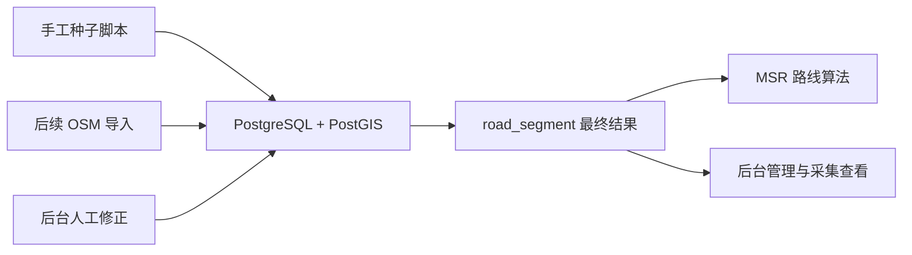

# 地图与种子数据设计

**日期：** 2026-07-11  
**项目：** 助老地图比赛版 MVP  
**子项目：** 重庆师范大学三号门 / 校医院 / 食堂试点的地图与种子数据

## 1. 目标

本设计只覆盖助老地图比赛版 MVP 的“地图与种子数据”子项目。

目标是为后续路线规划模块准备一套可直接使用的数据底座，满足以下要求：

- 覆盖重庆师范大学最小试点闭环
- 可通过脚本初始化导入
- 后续可通过后台编辑维护
- 当前以手工种子为主
- 结构上兼容未来 OSM 导入
- 数据字段可直接支撑 MSR 路线算法

本子项目完成后，系统需要能够基于三号门、校医院、食堂之间的核心步行路段进行候选路线计算。

## 2. 范围

### 2.1 地理范围

本轮只覆盖以下核心 POI 及其之间的主步行通道：

- 三号门
- 校医院 / 医务室
- 食堂

### 2.2 支持的典型路线

第一阶段至少支持：

- 三号门 -> 校医院
- 三号门 -> 食堂
- 校医院 -> 食堂

### 2.3 不在本轮范围内的内容

本轮不做：

- 全校路网覆盖
- 公交、打车、骑行、驾车路线
- 大规模 OSM 自动清洗导入
- 开放众包采集平台
- 复杂地图编辑器

## 3. 方案选择

本轮选择的方案为：

**双轨混合驱动**

具体含义：

- 第一版通过手工种子快速建立核心 POI、节点、路段和评分数据
- 同时按 OSM 可兼容的结构设计数据库和导入边界
- 当前以脚本初始化为主
- 后续保留后台可编辑能力

### 3.1 不选纯手工方案的原因

纯手工虽然最快，但后续接入 OSM 时容易产生结构断层，需要额外补做映射与清洗设计。

### 3.2 不选 OSM 优先方案的原因

OSM 优先更接近真实路网，但前期数据获取、筛选和清洗成本较高，不适合比赛 MVP 的节奏。

### 3.3 选择混合方案的原因

混合方案兼顾：

- 比赛演示速度
- 当前开发效率
- 后续真实路网扩展能力

## 4. 数据边界与种子结构

### 4.1 数据分层

本轮种子数据分两层：

#### 稳定核心层

稳定核心层由以下数据组成：

- 3 个核心 POI
- 一批关键路网节点
- 10 到 20 条核心路段
- 每条路段的初始适老评分

这部分是路线算法和比赛演示直接依赖的数据。

#### 可替换扩展层

可替换扩展层包括：

- 后续从 OSM 导入的真实路网
- 更多 POI
- 更多候选路段

这一层不会影响当前 MVP 的落地，但结构上必须兼容。

### 4.2 第一版坐标策略

第一版允许使用人工整理或近似坐标。

理由：

- 当前目标是打通可演示闭环
- 比赛阶段不要求厘米级地图精度
- 后续可以逐步替换为更精确数据

## 5. 核心数据模型

### 5.1 POI

第一版 `poi_facility` 至少包含：

- 三号门
- 校医院
- 食堂

后续可扩展：

- 座椅
- 公厕
- 公交站
- 无障碍坡道

### 5.2 路网节点

`road_node` 用于表示：

- 关键转折点
- 路口点
- 过街点
- POI 挂接点

### 5.3 路段

`road_segment` 是路线算法的核心输入。

每条路段必须至少具备：

- 起点节点
- 终点节点
- 几何信息
- 长度
- 坡度
- 平整度
- 安全性
- 无障碍性
- 休息设施便利度

### 5.4 种子数据进入方式

第一版同时支持：

- 脚本初始化导入
- 后台人工编辑

主路径为脚本初始化，后台编辑是后续修正与维护手段。

## 6. 路段切分规则

路段不按“整条路”存，而按“对老人体验有明显变化的最小可计算单元”切分。

### 6.1 必须切分的情况

- 到路口
- 坡度明显变化
- 台阶或坡道出现
- 斑马线或过街段出现
- 平整度明显变化
- 安全环境明显变化
- POI 附近需要挂接导航

### 6.2 数量控制

第一版核心路段数量控制在 10 到 20 条。

原因：

- 足够覆盖当前 3 条典型路线
- 足够支持 2 到 3 条候选路径比较
- 数据采集和录入工作量可控

## 7. 路段评分初始化方案

第一版评分统一采用 1 到 5 的整数等级。

### 7.1 坡度

数据库保留：

- `slope_percent` 原始数值

算法中映射为风险值，坡度越大，成本越高。

### 7.2 平整度

- 1 = 很差
- 5 = 很平整

### 7.3 安全性

- 1 = 高风险
- 5 = 很安全

### 7.4 无障碍性

- 1 = 几乎不可通行
- 5 = 非常友好

### 7.5 休息设施便利度

- 1 = 几乎无休息点
- 5 = 休息点充足

### 7.6 其他辅助评分

可同时保留：

- `lighting_level`
- `crossing_safety_level`
- `wheelchair_accessible`
- `step_count`

## 8. 种子数据导入策略

### 8.1 当前主路径

当前主路径为脚本初始化。

脚本负责导入：

- 核心 POI
- 核心节点
- 核心路段
- 初始评分

### 8.2 后台编辑职责

后台后续负责：

- 修改 POI 信息
- 修改路段评分
- 补充备注和照片
- 修正不准确数据

后台不是当前阶段前置条件，但结构上需要兼容。

## 9. 与 OSM 的未来边界

未来 OSM 接入时，职责边界如下：

### 9.1 OSM 负责

- 路网几何信息
- 节点位置
- 部分基础 POI

### 9.2 人工采集与后台负责

- 平整度
- 安全性
- 无障碍性
- 休息设施便利度
- 适老化修正

### 9.3 算法消费层

算法始终只读取整合后的最终 `road_segment`。

这意味着：

- OSM 是输入来源之一
- 不是算法直接依赖的唯一数据源

## 10. 数据流

## 11. 错误处理与一致性原则

### 11.1 数据一致性原则

- 同一条核心路段只保留一条最终有效记录
- 采集原始记录与审核结果分离
- 评分变更必须可追溯

### 11.2 第一版错误处理

如果出现以下情况：

- POI 坐标不精确
- 路段评分存在主观偏差
- 路段切分不够细

第一版优先通过：

- 后台编辑修正
- 重新导入种子脚本
- 人工复核

不在当前阶段引入复杂自动纠错流程。

## 12. 测试与验收标准

本轮完成后，以下条件必须满足：

- 建表脚本可执行
- 种子数据脚本可执行
- 数据库中存在三号门、校医院、食堂
- 数据库中存在核心节点和核心路段
- 核心路段字段完整，可直接用于路线成本计算
- 后端能查询出核心 POI 与核心路段

### 12.1 本轮成功标准

“地图与种子数据”这一轮完成，定义为：

- 系统已具备最小试点地图数据
- 数据可被后续路线算法直接读取
- 不需要再回头改数据库结构才能进入路线规划实现

## 13. 结论

本设计确定了比赛 MVP 的地图与种子数据策略：

- 试点只覆盖三号门、校医院、食堂
- 使用双轨混合驱动方案
- 第一版允许近似坐标
- 脚本初始化优先，后台编辑兼容
- 当前手工种子优先，未来兼容 OSM
- 交付结果必须直接支撑路线算法

这使得下一步可以直接进入实现计划编写，并随后开始开发：

- 种子数据脚本
- 数据库初始化
- 数据查询接口
- 路线规划输入准备

