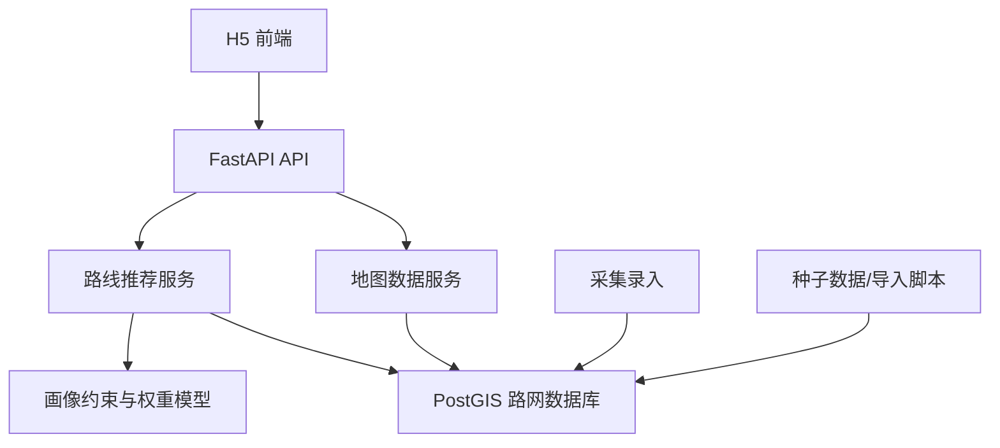

# 助老地图从 0 到完成总计划

**日期：** 2026-07-15  
**项目定位：** 面向比赛演示的适老化校园/社区路径规划系统  
**当前试点：** 重庆师范大学，三号门、校医院、食堂  
**当前阶段：** MVP 已跑通，进入“可演示、可讲解、可扩展”的完善阶段

## 1. 总目标

做一个不是普通最短路的助老地图系统。

系统需要根据不同老人画像，结合坡度、台阶、路宽、扶手、坡道、树荫、座椅、安全性、无障碍等级等因素，推荐更适合老人的步行路线，并能在比赛现场清楚展示：

- 为什么这条路适合这个老人
- 为什么轮椅老人不能走某些路段
- 为什么拐杖老人可以走但会被高惩罚
- 为什么慢行老人更偏好休息点、树荫和平缓路线
- 数据是怎么采集、录入、审核、用于计算的

## 2. 已完成基础

### 2.1 工程基础

- Python 3.11 Conda 环境
- FastAPI 后端
- PostgreSQL/PostGIS 数据库
- Docker Compose 数据库启动文件
- Vue 3 + Vite H5 前端
- GitHub 远程仓库：`https://github.com/CSQAlan/map.git`

### 2.2 后端能力

- 健康检查接口
- POI 查询接口
- 路段查询接口
- 路线推荐接口
- 数据库初始化脚本
- 种子数据导入脚本
- 路线推荐单元测试

### 2.3 算法能力

- 路网图建模
- 多路径枚举
- 路段成本计算
- TOP 候选路线排序
- 画像硬约束
- 画像差异化权重

当前支持画像：

- `WHEELCHAIR`：轮椅老人
- `CANE`：拐杖老人
- `SLOW_WALKER`：慢行老人
- `INDEPENDENT`：独立出行老人
- `FAMILY_ASSISTED`：家属陪同

### 2.4 数据库能力

当前 `road_segment` 已支持：

- 路段长度
- 坡度
- 路面类型
- 路宽
- 路面等级
- 安全等级
- 无障碍等级
- 休息设施评分
- 照明等级
- 过街安全等级
- 是否轮椅可通行
- 是否有扶手
- 是否有坡道
- 树荫覆盖率
- 座椅数量
- 台阶数量
- 台阶高度

### 2.5 前端能力

- 推荐模式
- 老人模式
- 老人画像切换
- 起点/终点选择
- 路线候选卡片
- 老人模式大字提示
- 模拟开始导航
- 模拟紧急求助

## 3. 核心产品边界

### 3.1 第一版不做

- 不做全重庆真实地图
- 不做真实在线导航
- 不做复杂账号体系
- 不做真实 SOS 短信/电话
- 不做公交/驾车/骑行
- 不做完整后台管理系统
- 不做过早的 AI 大模型推荐

### 3.2 第一版必须做好

- 重庆师范大学试点路网
- 三号门到校医院/食堂
- 不同老人画像路线推荐不同
- 数据库字段能支撑适老化解释
- 前端能稳定演示
- 文档能讲清楚算法和数据来源
- 测试能证明核心逻辑正确

## 4. 总体架构



## 5. 阶段路线图

## 阶段 0：项目基线整理

**目标：** 确保项目能被别人 clone、启动、理解。

**任务：**

- [x] 初始化 Git 仓库
- [x] 推送 GitHub
- [x] 编写 README
- [x] 配置 `.gitignore`
- [x] 配置 `.gitattributes`
- [x] 固定前端依赖锁文件
- [x] 保留后端 Conda 环境说明

**验收标准：**

- 新机器能根据 README 复现环境
- GitHub 仓库不包含 `.env`、`.conda`、`node_modules`、日志文件

## 阶段 1：试点路网和数据库打底

**目标：** 让系统有真实可算的试点路网。

**已完成：**

- [x] PostGIS 初始化脚本
- [x] POI 表
- [x] 路网节点表
- [x] 路段表
- [x] 采集记录表
- [x] 审核记录表
- [x] 路线规划记录表
- [x] 紧急事件表
- [x] 三号门、校医院、食堂种子数据
- [x] 11 条试点路段

**继续完善：**

- [ ] 校准 POI 坐标
- [ ] 校准每条路段名称
- [ ] 补充真实路段照片
- [ ] 补充真实路段采集备注
- [ ] 为每条路段确认路宽、台阶、坡道、扶手、树荫、座椅数据

**验收标准：**

- 数据库能一键初始化
- 种子数据重复导入不会产生重复记录
- 至少能从三号门到校医院/食堂生成 3 条候选路线

## 阶段 2：适老路线算法 MVP

**目标：** 让推荐不只是最短路，而是适老化路线。

**已完成：**

- [x] 路段成本计算
- [x] 路径枚举
- [x] TOP 候选路线排序
- [x] 画像权重
- [x] 轮椅硬约束
- [x] 拐杖高惩罚
- [x] 慢行偏好休息点和树荫
- [x] 路线解释 summary
- [x] 单元测试覆盖画像差异

**继续完善：**

- [ ] 将 DFS 枚举升级为 Dijkstra
- [ ] 支持多策略推荐：最安全、最平缓、最舒适、最短距离
- [x] 增加每条路线的详细解释分解
- [x] 返回每条路段的风险标签
- [x] 增加不可通行原因说明
- [ ] 支持用户自定义权重

**算法目标形态：**

```text
路线推荐 = 硬约束过滤 + 多因素成本计算 + 候选路径排序 + 推荐原因解释
```

**验收标准：**

- 轮椅老人不会推荐带台阶且无坡道的路段
- 拐杖老人可以保留少量台阶路段，但排名靠后
- 慢行老人更偏好休息点、树荫、平缓路线
- 每条推荐路线都能解释原因

## 阶段 3：后端 API 完善

**目标：** 让前端和后续管理端有稳定接口。

**已完成：**

- [x] `/api/health`
- [x] `/api/map-data/pois`
- [x] `/api/map-data/segments`
- [x] `/api/routes/recommend`

**继续完善：**

- [x] `/api/routes/recommend` 返回路段详情
- [x] `/api/routes/recommend` 返回不可通行过滤原因
- [ ] `/api/profiles` 老人画像接口
- [x] `/api/collect/segments` 路段采集提交接口
- [x] `/api/collect/segments/{id}/audit` 路段审核接口
- [x] `/api/diagnostics/segments` 适老化诊断建议接口
- [x] `/api/emergency/sos` 模拟 SOS 记录接口
- [ ] API 错误响应统一格式

**验收标准：**

- Swagger 文档能清楚展示所有接口
- 前端不依赖假数据
- 核心接口有测试

## 阶段 4：H5 演示前端完善

**目标：** 让比赛现场一眼看懂系统价值。

**已完成：**

- [x] Vue 3 + Vite
- [x] 推荐模式
- [x] 老人模式
- [x] 画像切换
- [x] 路线卡片
- [x] 大字按钮
- [x] 前端构建通过

**继续完善：**

- [x] 路线解释分解展示
- [x] 路段风险标签展示
- [x] 轮椅不可走路段提示
- [x] 适老化诊断建议展示
- [x] 加一个简化校园示意图
- [x] 路线流程线升级为可视化路径
- [ ] 老人模式加入语音播报按钮
- [x] SOS 从前端模拟升级为后端记录
- [x] 移动端适配复查

**验收标准：**

- 现场打开页面 10 秒内能看懂项目
- 切换画像后能看到路线推荐逻辑差异
- 老人模式按钮足够大、文字足够清楚

## 阶段 5：数据采集与录入

**目标：** 解释清楚“数据从哪里来”，并能做基础录入。

**采集内容：**

- 路段起止点
- 路段名称
- 长度
- 坡度
- 路宽
- 路面类型
- 路面平整度
- 安全等级
- 无障碍等级
- 台阶数量
- 台阶高度
- 是否有坡道
- 是否有扶手
- 树荫覆盖率
- 座椅数量
- 照明情况
- 过街安全
- 现场照片
- 采集备注

**继续完善：**

- [x] 制作采集表 Excel/CSV 模板
- [x] 写 CSV 导入脚本
- [x] 做简易采集录入页面
- [x] 做管理员审核接口
- [x] 做采集数据覆盖到正式路段的流程

**验收标准：**

- 队友能拿手机/表格去现场采集
- 采集结果能导入数据库
- 每个字段都有评分说明

## 阶段 6：地图能力

**目标：** 逐步从“路线卡片”升级到“可视化地图”。

**第一步：简化地图**

- [x] 用 SVG 或 Canvas 画校园简图
- [x] 标出三号门、校医院、食堂
- [x] 用不同颜色画候选路线
- [x] 用红色/灰色标不可通行路段

**第二步：真实地图**

- [ ] 评估 Leaflet
- [ ] 评估高德地图
- [ ] 评估腾讯地图
- [ ] 接入真实底图
- [ ] 展示 PostGIS 路段几何

**验收标准：**

- 第一版比赛演示不依赖外部地图服务也能讲清楚
- 后续能切换到真实地图底图

## 阶段 7：适老诊断与改造建议

**目标：** 让项目不只是导航，还能给校园/社区管理者提供改造建议。

**功能方向：**

- [x] 识别高风险路段
- [x] 识别轮椅断链路段
- [x] 识别缺少座椅区域
- [x] 识别缺少树荫区域
- [x] 识别台阶无扶手路段
- [x] 输出改造清单

**示例输出：**

```text
建议 1：食堂入口侧路存在 2 级台阶且无坡道，轮椅画像不可通行，建议增设坡道。
建议 2：三号门到主路口 A 路段缺少休息设施，建议增加座椅。
建议 3：主路口 B 到食堂路面平整度较低，建议修补或铺设防滑材质。
```

**验收标准：**

- 能生成一份校园适老化改造建议
- 建议能对应到具体路段和字段

## 阶段 8：比赛展示材料

**目标：** 让评委能快速理解项目创新点和落地性。

**需要准备：**

- [ ] 项目介绍 PPT
- [ ] 系统架构图
- [ ] 数据库 ER 图
- [ ] 算法流程图
- [ ] 画像差异示例图
- [ ] 路线推荐演示视频
- [ ] 数据采集标准文档
- [ ] 适老化改造建议样例
- [ ] 项目 README 完整版

**核心讲法：**

```text
普通导航解决“怎么最快到达”。
助老地图解决“这个老人能不能安全到达，以及为什么推荐这条路”。
```

**验收标准：**

- 3 分钟能讲清楚项目
- 8 分钟能完整演示
- 问到算法、数据、落地、扩展时都有答案

## 阶段 9：部署和交付

**目标：** 比赛当天稳定运行。

**本地演示方案：**

- [ ] 一键启动数据库
- [ ] 一键启动后端
- [ ] 一键启动前端
- [ ] 准备离线演示数据
- [ ] 准备备用截图和视频

**线上演示方案：**

- [ ] 后端部署到云服务器
- [ ] 数据库部署到云服务器或托管数据库
- [ ] 前端部署到静态站点
- [ ] 配置环境变量
- [ ] 配置域名或固定访问地址

**验收标准：**

- 本地演示可用
- 网络不好时有备用方案
- 数据库重启后可恢复

## 6. 推荐开发顺序

### 第一优先级

1. 路线解释增强
2. 路段详情返回
3. 前端展示路段风险标签
4. 简化校园路线图
5. 数据采集模板

### 第二优先级

1. Dijkstra 替换 DFS
2. 多策略路线推荐
3. SOS 后端记录
4. 采集录入接口
5. 管理员审核接口

### 第三优先级

1. 真实地图底图
2. 语音播报
3. 家属端
4. 线上部署
5. 社区诊断仪表盘

## 7. 下一轮具体任务

建议下一轮先做：

```text
路线解释增强 + 路段风险标签 + 前端展示
```

原因：

- 这个最贴近比赛演示
- 能直接体现算法价值
- 不依赖复杂地图
- 工作量可控
- 可以让评委看到“为什么推荐”

下一轮验收目标：

- 每条路线显示“推荐原因”
- 每条路段显示“风险标签”
- 轮椅画像能看到“已避开台阶/窄路”
- 拐杖画像能看到“台阶风险较高”
- 慢行画像能看到“休息点/树荫友好”

## 8. 风险和控制

| 风险 | 影响 | 控制方式 |
| --- | --- | --- |
| 真实地图接入复杂 | 影响进度 | 第一版先用简化示意图 |
| 现场数据不准 | 影响算法可信度 | 用采集标准和照片解释 |
| 画像过多 | 逻辑混乱 | 先保留 5 类核心画像 |
| 路网太小 | TOP 路线不明显 | 继续补替代路段 |
| 部署不稳定 | 比赛演示失败 | 准备本地离线方案 |

## 9. 完成定义

项目达到“比赛可交付”需要满足：

- 后端接口稳定
- 前端演示稳定
- 数据库设计完整
- 算法能体现适老化差异
- 数据采集流程讲得清
- 至少一个试点区域完整闭环
- 有 PPT、架构图、算法图、演示视频
- GitHub 仓库代码和文档整洁

项目达到“后续可扩展”需要满足：

- 支持更多 POI
- 支持更多路段导入
- 支持真实地图底图
- 支持采集审核
- 支持适老化诊断
- 支持部署上线
