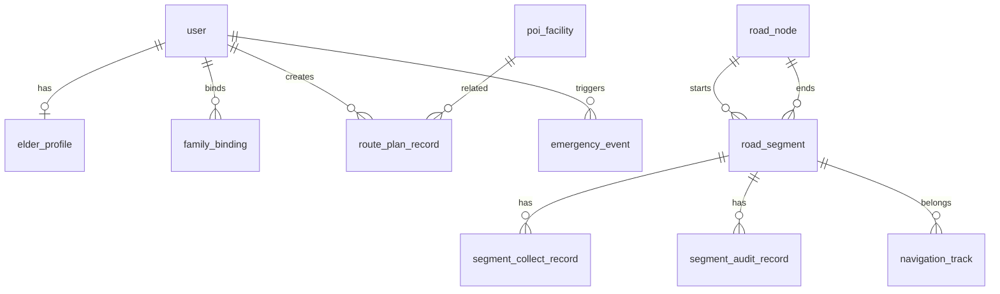

# 助老地图数据库设计与采集标准

## 1. 试点范围确认

当前 MVP 试点正式收敛为：

- 起点入口：重庆师范大学 `三号门`
- 重点目的地 1：`校医院 / 医务室`
- 重点目的地 2：`食堂`

第一阶段重点支持以下典型路线：

- 三号门 -> 校医院
- 三号门 -> 食堂
- 校医院 -> 食堂

## 2. 数据设计目标

数据库设计需要同时满足 4 件事：

- 支撑地图路网和空间查询
- 支撑老人画像与路线推荐
- 支撑数据采集和审核
- 支撑比赛演示与结果留痕

## 3. 数据库选型

- 数据库：`PostgreSQL 16`
- 空间扩展：`PostGIS`
- 字符集：`UTF-8`
- 时间字段：统一用 `timestamp with time zone`

## 4. 设计原则

- 第一阶段优先 `够用、清晰、可维护`
- 路线规划基于“路段”而不是整条道路
- 采集数据与审核数据分开存
- 重要记录保留状态字段，不做硬删除

## 5. 核心实体关系

## 6. 核心表设计

## 6.1 `user`

用户基础表，存老人、家属、管理员。

建议字段：

- `id` `bigserial` 主键
- `username` `varchar(50)` 唯一
- `password_hash` `varchar(255)`
- `role` `varchar(20)`
- `display_name` `varchar(50)`
- `phone` `varchar(20)` 可空
- `status` `varchar(20)` 默认 `ACTIVE`
- `created_at`
- `updated_at`

角色建议：

- `ELDER`
- `FAMILY`
- `ADMIN`

索引建议：

- `uk_user_username`
- `idx_user_role`

## 6.2 `elder_profile`

老人画像表，一位老人一份画像。

建议字段：

- `id` `bigserial`
- `user_id` `bigint` 唯一，关联 `user.id`
- `mobility_type` `varchar(30)`
- `needs_cane` `boolean`
- `uses_wheelchair` `boolean`
- `max_slope_percent` `numeric(5,2)`
- `max_walk_distance_m` `integer`
- `prefer_rest_facility` `boolean`
- `prefer_safer_crossing` `boolean`
- `voice_first` `boolean`
- `route_weight_profile` `jsonb`
- `created_at`
- `updated_at`

说明：

- `route_weight_profile` 用来存路线权重，例如坡度、安全、距离的权重配置

首版画像类型建议：

- `INDEPENDENT`
- `ASSISTED`
- `FAMILY_ASSISTED`

## 6.3 `family_binding`

家属绑定关系表。

建议字段：

- `id` `bigserial`
- `elder_user_id` `bigint`
- `family_user_id` `bigint`
- `relation_type` `varchar(20)` 例如 `CHILD`
- `is_emergency_contact` `boolean`
- `status` `varchar(20)`
- `created_at`

索引建议：

- `idx_family_binding_elder`
- `idx_family_binding_family`

## 6.4 `poi_facility`

POI 和适老设施点。

建议字段：

- `id` `bigserial`
- `name` `varchar(100)`
- `poi_type` `varchar(30)`
- `description` `varchar(255)` 可空
- `geom` `geometry(Point, 4326)`
- `address_text` `varchar(255)` 可空
- `is_accessible` `boolean`
- `status` `varchar(20)`
- `source` `varchar(20)` 例如 `OSM`、`MANUAL`
- `created_at`
- `updated_at`

首版 `poi_type` 建议：

- `GATE`
- `CLINIC`
- `CANTEEN`
- `BUS_STOP`
- `REST_SEAT`
- `TOILET`
- `RAMP`

试点首批必须录入：

- 三号门
- 校医院
- 食堂

空间索引建议：

- `gist_poi_facility_geom`

## 6.5 `road_node`

路网节点表。

建议字段：

- `id` `bigserial`
- `osm_node_ref` `varchar(50)` 可空
- `name` `varchar(100)` 可空
- `geom` `geometry(Point, 4326)`
- `node_type` `varchar(20)` 默认 `NORMAL`
- `created_at`

空间索引建议：

- `gist_road_node_geom`

## 6.6 `road_segment`

最核心的路段表，算法直接读这张表。

建议字段：

- `id` `bigserial`
- `segment_code` `varchar(50)` 唯一
- `start_node_id` `bigint`
- `end_node_id` `bigint`
- `name` `varchar(100)` 可空
- `geom` `geometry(LineString, 4326)`
- `length_m` `numeric(10,2)`
- `slope_percent` `numeric(5,2)`
- `surface_level` `smallint`
- `safety_level` `smallint`
- `barrier_free_level` `smallint`
- `rest_facility_score` `smallint`
- `lighting_level` `smallint`
- `crossing_safety_level` `smallint`
- `wheelchair_accessible` `boolean`
- `step_count` `integer`
- `status` `varchar(20)` 默认 `ACTIVE`
- `data_source` `varchar(20)` 例如 `OSM_DEM_MANUAL`
- `created_at`
- `updated_at`

字段解释建议：

- `surface_level`
  - 1 = 很差
  - 2 = 较差
  - 3 = 一般
  - 4 = 良好
  - 5 = 很好
- `safety_level`
  - 1 = 高风险
  - 5 = 很安全
- `barrier_free_level`
  - 1 = 很差
  - 5 = 很好
- `rest_facility_score`
  - 1 = 附近几乎无休息点
  - 5 = 休息点充足

重要说明：

- 路线算法实际会把“好评分”转换成“低成本”
- 比赛阶段评分建议统一用 1 到 5，最容易采集和解释

核心索引建议：

- `uk_road_segment_code`
- `idx_road_segment_start_node_id`
- `idx_road_segment_end_node_id`
- `gist_road_segment_geom`

## 6.7 `segment_collect_record`

路段采集原始记录表。

建议字段：

- `id` `bigserial`
- `road_segment_id` `bigint`
- `collector_user_id` `bigint`
- `surface_level` `smallint`
- `safety_level` `smallint`
- `barrier_free_level` `smallint`
- `rest_facility_score` `smallint`
- `lighting_level` `smallint`
- `crossing_safety_level` `smallint`
- `wheelchair_accessible` `boolean`
- `step_count` `integer`
- `remark` `varchar(500)` 可空
- `photo_urls` `jsonb`
- `collect_time`
- `status` `varchar(20)` 默认 `PENDING`
- `created_at`

用途：

- 保存一次采集行为的原始结果
- 后续审核通过后再同步到 `road_segment`

## 6.8 `segment_audit_record`

路段审核记录表。

建议字段：

- `id` `bigserial`
- `road_segment_id` `bigint`
- `collect_record_id` `bigint`
- `auditor_user_id` `bigint`
- `audit_result` `varchar(20)`
- `audit_comment` `varchar(500)` 可空
- `before_snapshot` `jsonb`
- `after_snapshot` `jsonb`
- `created_at`

建议 `audit_result`：

- `APPROVED`
- `REJECTED`
- `UPDATED`

## 6.9 `route_plan_record`

路线规划记录表，支持演示和统计。

建议字段：

- `id` `bigserial`
- `user_id` `bigint`
- `profile_snapshot` `jsonb`
- `start_poi_id` `bigint` 可空
- `end_poi_id` `bigint` 可空
- `start_point` `geometry(Point, 4326)` 可空
- `end_point` `geometry(Point, 4326)` 可空
- `route_rank` `smallint`
- `route_score` `numeric(10,2)`
- `distance_m` `numeric(10,2)`
- `estimated_minutes` `integer`
- `segment_ids` `jsonb`
- `route_summary` `jsonb`
- `selected_by_user` `boolean`
- `created_at`

说明：

- 一次规划返回 3 条路线，可以存 3 条记录，`route_rank` 分别为 1、2、3

## 6.10 `navigation_track`

导航轨迹表。

建议字段：

- `id` `bigserial`
- `route_plan_record_id` `bigint`
- `user_id` `bigint`
- `track_point` `geometry(Point, 4326)`
- `sequence_no` `integer`
- `speed_mps` `numeric(8,2)` 可空
- `is_off_route` `boolean`
- `recorded_at`

空间索引建议：

- `gist_navigation_track_point`

## 6.11 `emergency_event`

求助和异常事件表。

建议字段：

- `id` `bigserial`
- `user_id` `bigint`
- `event_type` `varchar(30)`
- `event_status` `varchar(20)`
- `trigger_point` `geometry(Point, 4326)` 可空
- `related_route_plan_id` `bigint` 可空
- `description` `varchar(500)` 可空
- `notified_contacts` `jsonb`
- `created_at`
- `resolved_at` 可空

首版 `event_type` 建议：

- `SOS`
- `LONG_STOP`
- `OFF_ROUTE`

## 7. 首版最小表集

如果你们想先少一点，我建议第一阶段最少先上这 8 张：

- `user`
- `elder_profile`
- `family_binding`
- `poi_facility`
- `road_node`
- `road_segment`
- `route_plan_record`
- `emergency_event`

第二阶段再补：

- `segment_collect_record`
- `segment_audit_record`
- `navigation_track`

## 8. 路段评分标准建议

## 8.1 坡度

- 1 级：非常平缓，适老友好
- 2 级：较平缓
- 3 级：可接受
- 4 级：偏陡
- 5 级：较危险

数据库里建议同时保留：

- `slope_percent` 原始数值
- 算法计算时再映射成风险值

## 8.2 平整度

- 1 级：坑洼严重 / 破损明显
- 2 级：较差
- 3 级：一般
- 4 级：较好
- 5 级：平整

## 8.3 安全性

- 1 级：高风险
- 2 级：较高风险
- 3 级：一般
- 4 级：较安全
- 5 级：安全

评价参考：

- 是否靠近车流
- 过街是否安全
- 夜间照明是否充足

## 8.4 无障碍性

- 1 级：几乎不可通行
- 2 级：通过困难
- 3 级：一般
- 4 级：较友好
- 5 级：非常友好

## 9. 数据采集标准

## 9.1 采集对象

围绕三号门、校医院、食堂三点之间的主步行通道，优先采：

- 主通道路段
- 关键路口
- 休息设施点
- 公厕
- 无障碍坡道

## 9.2 每条路段至少采集这些字段

- 路段起点
- 路段终点
- 路面平整度
- 坡度体感
- 是否有台阶
- 是否轮椅可通行
- 夜间照明情况
- 过街是否安全
- 附近是否有休息点
- 现场照片

## 9.3 采集规则建议

- 一条路段至少拍 2 张照片
- 争议路段至少 2 人交叉采集
- 核心路线优先采集
- 同一路段如意见不一致，以审核结论为准

## 9.4 路段切分建议

不要把很长一整条路只存成 1 段。

建议在以下情况切分：

- 坡度明显变化
- 平整度变化
- 出现台阶 / 坡道
- 进入路口或斑马线
- 安全环境明显变化

## 10. 首版路线算法字段映射建议

算法读取 `road_segment` 时，可以先这样转成本：

- 坡度越大，成本越高
- 平整度越低，成本越高
- 安全等级越低，成本越高
- 无障碍等级越低，成本越高
- 休息设施得分越低，成本越高

首版示意公式：

`cost = w1*slope_risk + w2*surface_risk + w3*safety_risk + w4*distance_cost + w5*rest_risk`

其中：

- `slope_risk` 可由 `slope_percent` 映射
- `surface_risk = 6 - surface_level`
- `safety_risk = 6 - safety_level`
- `rest_risk = 6 - rest_facility_score`

## 11. 命名建议

为了后端代码更顺手，建议统一：

- 表名：下划线风格
- 字段名：下划线风格
- 布尔字段：`is_` / `has_` / 明确语义
- 状态字段：统一 `status`

## 12. 当前建议结论

如果按比赛 MVP 最稳的方式推进，这版数据库设计已经足够支撑：

- 三号门
- 校医院
- 食堂
- 适老路线推荐
- 家属协同
- 数据采集录入
- 后续轨迹和告警扩展

下一步最自然的工作就是：

- 依据这份设计出 `SQL 建表草案`
- 再开始搭 `FastAPI + SQLAlchemy` 项目骨架

