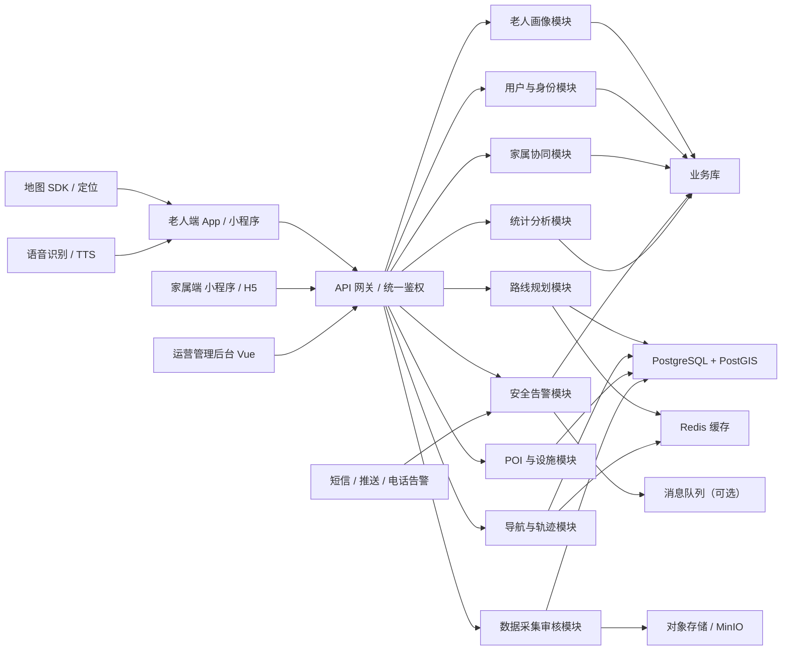

# 助老地图系统架构设计（Java 版建议）

## 1. 结论先说

这个项目适合做，但不建议一开始就做成“大而全”的地图平台。

更稳的做法是：

- 后端以 `Java + Spring Boot` 为主
- 数据核心用 `PostgreSQL + PostGIS`
- 第一阶段采用“**模块化单体**”而不是微服务
- 先围绕一个试点区域做 `MVP`
- 先把“适老路线推荐”做准，再逐步扩展摔倒检测、众包采集和家属协同

这样最适合当前这个项目：

- 需求明确，但数据仍在探索期
- 试点范围小，不需要一开始就拆很多服务
- 你是 Java 背景，后端用 Java 更容易推进

## 2. 为什么不建议先按文档里的 Python 方案做

文档里提到 `Python / Django`，它能做，但如果你们主力更熟 Java，那么第一阶段没必要为了“看起来更适合算法”去切语言。

对这个项目来说：

- 路线规划不等于深度学习，核心是图搜索、空间查询和规则打分
- 这些能力 Java 完全能做
- 真正难的是路段数据建模，不是语言本身

所以更建议：

- 后端主业务：`Java`
- 算法实现：也先放在 `Java` 内
- 未来如果真出现复杂模型训练，再单独补一个 Python 算法服务

## 3. 总体架构建议

### 3.1 当前阶段推荐架构

采用“客户端 + Java 后端 + GIS 数据底座 + 运营后台”的结构。

### 3.2 架构原则

- `先单体后拆分`：MVP 阶段避免过早微服务化
- `空间数据优先`：路线能力的核心不是普通关系库，而是 `PostGIS`
- `规则优先于模型`：先做可解释的评分和权重，不急着上 AI
- `试点优先于全城`：先把一个区域跑通
- `可运营可校准`：路线结果必须能被人工审核和持续调权

## 4. 技术选型建议

### 4.1 后端

- 核心框架：`Spring Boot 3`
- 接口层：`Spring Web`
- 安全认证：`Spring Security + JWT`
- 数据访问：`MyBatis-Plus` 或 `JPA`
- 空间数据：`PostgreSQL + PostGIS`
- 缓存：`Redis`
- 对象存储：`MinIO`
- 异步任务：`RabbitMQ` 或 `Spring Event`
- 定时任务：`XXL-JOB` 或 `Spring Scheduler`

### 4.2 前端

- 运营后台：`Vue 3 + Element Plus`
- 家属端：优先 `小程序 / H5`
- 老人端：
  - 如果强调快速试点：`uni-app`
  - 如果强调传感器和稳定性：`Android 原生 / Kotlin`

不建议当前阶段强行选 Flutter，只因为文档里写了它。  
如果你们团队没有 Flutter 经验，它反而会增加启动成本。

### 4.3 地图与算法

- 地图底图：优先对接成熟地图 SDK
- 路网与空间计算：`PostGIS`
- 路线引擎：Java 内部实现 `A* + 多权重成本函数 + TOP3 候选路线`
- 后续升级：可引入 `K 最短路`、`动态权重`、`用户历史偏好`

## 5. 为什么先做模块化单体

这个项目现在最不确定的是：

- 路段数据怎么采
- 权重怎么算更合理
- 哪些功能真能被老人用起来

这意味着你们会频繁改表结构、改评分逻辑、改接口。

如果一开始就拆成很多服务，会出现三个问题：

- 联调复杂
- 部署麻烦
- 需求一变就要多处改动

所以第一阶段建议把系统做成一个 Java 主工程，内部按模块分包：

- `user`
- `profile`
- `route`
- `navigation`
- `safety`
- `family`
- `poi`
- `collector`
- `admin`
- `analytics`

等试点跑通后，再考虑把以下模块独立出去：

- 路线规划服务
- 安全告警服务
- 数据采集审核服务

## 6. 核心模块说明

### 6.1 用户与身份模块

负责：

- 老人、家属、运营人员账号
- 登录、鉴权、角色权限
- 紧急联系人绑定

角色建议：

- `ELDER`
- `FAMILY`
- `OPERATOR`
- `ADMIN`

### 6.2 老人画像模块

这是路线推荐的输入核心。

主要保存：

- 年龄段
- 出行类型
- 是否需要拐杖/助行器
- 是否轮椅出行
- 最大可接受坡度
- 最大连续步行距离
- 偏好休息点密度
- 是否语音优先

这部分不要一开始做复杂 AI 画像，先做“问卷配置 + 人工可调整”的结构。

### 6.3 路线规划模块

这是项目最关键的模块。

输入：

- 起点、终点
- 用户画像
- 当前时段
- 是否轮椅/陪同

核心逻辑：

- 先从空间库拿出候选路网
- 给每条路段计算综合成本
- 用 A* 找到最优路线
- 再生成 TOP-3 候选路线

建议成本函数：

`cost = w1*坡度 + w2*平整度 + w3*休息设施缺乏度 + w4*安全风险 + w5*距离`

可增加硬约束：

- 轮椅用户禁入超过阈值坡度路段
- 缺少无障碍通道的路段直接排除
- 夜间低照明高风险路段提高惩罚值

### 6.4 导航与轨迹模块

负责：

- 开始导航
- 当前定位刷新
- 偏航检测
- 自动重规划
- 轨迹记录

老人端交互要极简：

- 只显示下一步动作
- 语音播报优先
- 大按钮返回主页

### 6.5 安全告警模块

负责：

- 一键 SOS
- 异常停留提醒
- 偏离安全区域提醒
- 通知家属和运营方

第一版建议先做：

- 手动求助
- 异常静止超时提醒
- 位置共享

不建议第一版就承诺“高准确率自动摔倒识别”。

### 6.6 家属协同模块

负责：

- 查看老人实时位置
- 接收偏航/求助通知
- 查看预计到达时间
- 帮老人发起导航

这是“照护陪同型”用户的关键能力。

### 6.7 POI 与设施模块

负责维护适老路线依赖的设施点：

- 座椅
- 公厕
- 药店
- 卫生站
- 公交站
- 无障碍入口

这部分既是展示数据，也是路线评分数据。

### 6.8 数据采集审核模块

负责：

- 众包上传照片
- 路段平整度打分
- 风险点上报
- 运营审核

这部分决定路线质量，优先级很高。

### 6.9 统计分析模块

负责：

- 路线采纳率
- 导航完成率
- 偏航率
- 求助率
- 用户满意度
- 不同画像下的最优权重效果

这部分直接支撑你们试点评估报告。

## 7. 路线引擎的数据建模建议

路线推荐不要直接基于“整条路”存数据，而是基于“路段边”存数据。

最核心的是一张 `road_segment`：

- `id`
- `start_node_id`
- `end_node_id`
- `geometry`
- `length`
- `slope`
- `surface_level`
- `rest_facility_score`
- `crossing_safety_score`
- `lighting_score`
- `barrier_free_flag`
- `wheelchair_accessible_flag`
- `status`

辅助表建议：

- `user_profile`
- `poi_facility`
- `route_plan_record`
- `navigation_track`
- `emergency_event`
- `family_binding`
- `segment_report`
- `segment_audit_record`

## 8. MVP 范围建议

### 8.1 一定要做

- 老人画像配置
- 试点区域路段数据导入
- 基于多权重的路线推荐
- TOP-3 路线返回
- 导航过程中的偏航重算
- SOS 求助
- 家属位置查看
- 运营后台审核设施点和路段评分

### 8.2 可以第二阶段再做

- 自动摔倒检测
- 重庆方言语音深度优化
- 众包大规模开放
- 个性化权重自动学习
- 多城市扩展

## 9. 推荐开发顺序

### 第一阶段：打通最小闭环

- 完成用户、画像、路段、POI 基础表
- 导入试点区域路网
- 实现路线评分和 A* 搜索
- 后台可维护路段评分

### 第二阶段：做可用导航

- 老人端路线选择
- 语音播报
- 定位与偏航重算
- 家属端查看位置

### 第三阶段：做安全与评估

- SOS
- 异常停留提醒
- 轨迹留痕
- 统计分析报表

## 10. 未来扩展路线

当试点稳定后，再演进成服务化结构：

- `route-service`：专门负责路线规划
- `safety-service`：负责告警与通知
- `collector-service`：负责采集与审核流程
- `analytics-service`：负责评估与报表

但这一步建议放在 MVP 成功之后，而不是现在。

## 11. 最终建议

如果站在“你是 Java 背景、项目要尽快落地”的角度，我的最终建议是：

- 后端用 `Spring Boot + PostGIS + Redis`
- 第一阶段做 `模块化单体`
- 前端后台用 `Vue`
- 老人端优先考虑 `uni-app` 或 Android 原生
- 算法先用“可解释的多权重 A*”，不要一开始搞复杂 AI

这套方案的优点是：

- 你能掌控
- 团队更容易招人和协作
- 试点更快落地
- 未来也有平滑升级空间

