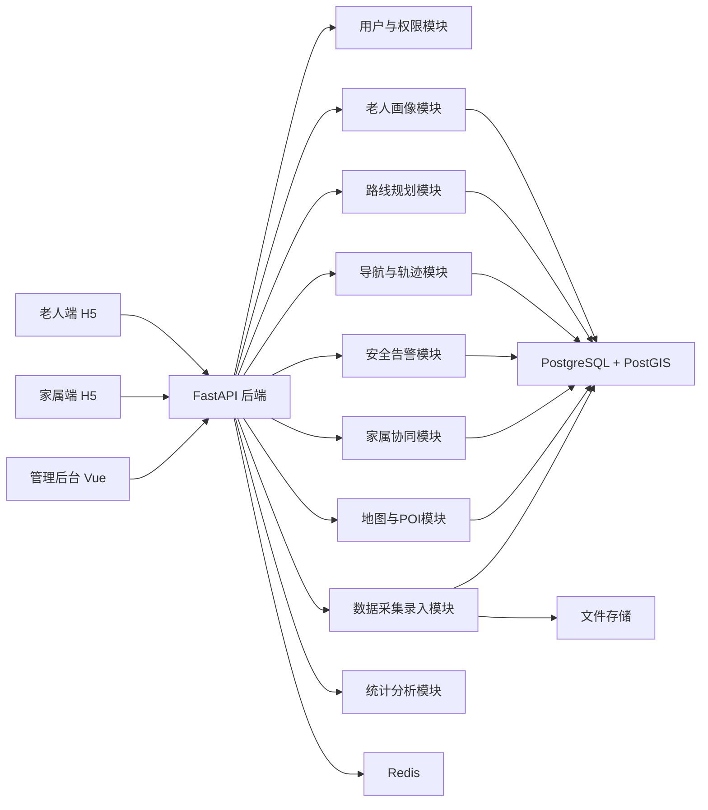

# 助老地图比赛版实施计划

## 1. 项目目标

### 1.1 项目定位

本项目不是做一个通用地图平台，而是做一个面向老年人的“适老化步行导航系统”比赛版原型。

核心目标：

- 面向重庆师范大学试点区域
- 聚焦步行导航
- 用“最适合路径（MSR）”替代“最短路径”
- 做出一个可演示、可答辩、可解释的 MVP

### 1.2 比赛版成功标准

比赛阶段不追求全城覆盖，不追求工业级精度，优先做到以下几点：

- 能在试点区域完成路线推荐
- 能体现“适老化”和普通导航的区别
- 能展示不同老人画像下的不同路线结果
- 能展示基础安全能力
- 有后台可录入和维护试点数据
- 架构、算法、数据流程讲得清楚

## 2. 试点范围

### 2.1 地理范围

首期试点区域定为：

- 重庆师范大学校内主要道路
- 校门口至周边高频出行区域的步行道路
- 可优先覆盖校医院、食堂、宿舍区、教学楼、公交站、校门、社区服务点等典型路径

### 2.2 导航范围

第一阶段仅做：

- 步行导航

暂不纳入：

- 公交换乘
- 打车
- 骑行
- 驾车

原因：

- 步行最能体现坡度、路面平整度、安全性差异
- 适合老年人场景
- 数据建模相对可控
- 更适合作为比赛 MVP

## 3. MVP 功能边界

### 3.1 必做功能

- 老人画像配置
- 起点终点选择
- 适老路线推荐
- 返回 TOP-3 候选路线
- 显示路线差异说明
- 导航中当前位置展示
- 偏航提醒与重新规划
- 一键紧急求助
- 家属查看老人位置
- 后台录入路段和 POI 数据

### 3.2 可选加分功能

- 路线风险说明卡片
- 夜间模式 / 高对比模式
- 语音播报下一步指令
- 休息点推荐
- 到达时间和疲劳提示

### 3.3 暂缓功能

- 自动摔倒检测
- 多交通方式混合导航
- 大规模众包采集
- 复杂 AI 训练模型
- 全市地图覆盖

## 4. 技术路线

### 4.1 技术栈

- 老人端：`Vue 3 + Vite + H5`
- 管理后台：`Vue 3 + Element Plus`
- 后端：`FastAPI`
- 数据库：`PostgreSQL + PostGIS`
- 缓存：`Redis`
- ORM：`SQLAlchemy`
- 空间计算：`PostGIS + Python`
- 路线算法：`A* + 多权重成本函数`
- 文件存储：本地存储或 `MinIO`

### 4.2 架构形态

比赛阶段采用：

- 单体应用架构

原因：

- 开发快
- 联调简单
- 演示稳定
- 便于快速迭代

## 5. 系统架构

## 6. 核心模块说明

### 6.1 用户与权限模块

负责：

- 老人账号
- 家属账号
- 管理员账号
- 登录与权限控制

### 6.2 老人画像模块

负责保存老人出行能力参数，例如：

- 出行类型
- 是否需拐杖
- 是否轮椅出行
- 最大可接受坡度
- 最大连续步行距离
- 对平坦度、安全性、休息点的偏好

### 6.3 路线规划模块

核心模块，负责：

- 接收起点终点
- 读取老人画像
- 从路网中计算最适合路线
- 返回 TOP-3 路线
- 输出每条路线的评分说明

### 6.4 导航与轨迹模块

负责：

- 当前定位展示
- 路线跟踪
- 偏航识别
- 自动重新规划
- 历史轨迹记录

### 6.5 安全告警模块

负责：

- 一键求助
- 异常停留提示
- 告警通知家属

### 6.6 家属协同模块

负责：

- 查看老人实时位置
- 接收告警
- 查看导航状态

### 6.7 地图与 POI 模块

负责：

- 维护路网
- 维护 POI
- 维护适老设施
- 为路线评分提供基础数据

### 6.8 数据采集录入模块

负责：

- 路段属性录入
- 图片上传
- 平整度与安全性标注
- 审核与修订

## 7. 地图导入方案

### 7.1 数据来源

地图相关数据分三类：

- 基础路网数据：`OpenStreetMap`
- 高程数据：`SRTM DEM`
- 人工补充数据：试点采集数据

### 7.2 地图导入目标

我们不是导入一张“可看地图”就结束，而是要导入“可计算路线的路网数据”。

需要最终形成：

- 路段节点
- 路段几何信息
- 路段长度
- 路段坡度
- 路段平整度
- 路段安全等级
- 路段无障碍属性
- 附近休息设施密度

### 7.3 导入步骤

#### 第一步：圈定试点范围

- 以重庆师范大学为中心圈定试点边界
- 优先覆盖高频步行区域

#### 第二步：下载 OSM 数据

- 获取试点范围内道路、步道、出入口等基础路网
- 只保留步行相关道路

#### 第三步：导入 PostGIS

- 将道路数据导入 `PostgreSQL + PostGIS`
- 建立基础道路表、节点表、POI 表

#### 第四步：叠加 DEM 数据

- 获取试点区域高程数据
- 计算每条路段坡度

#### 第五步：生成比赛版路段表

将基础道路切分为可评分的路段单元，形成 `road_segment`。

### 7.4 导入后的核心表

建议最先建立以下空间数据表：

- `road_node`
- `road_segment`
- `poi_facility`
- `area_boundary`

## 8. 数据采集方案

### 8.1 采集原则

比赛阶段不追求大规模众包，采用“小范围、高质量、人工可控”的采集方式。

### 8.2 需要采集的重点数据

#### 路段类

- 路面是否平整
- 是否有明显台阶
- 是否有陡坡
- 是否有连续坡道
- 夜间照明情况
- 路宽是否足够
- 是否适合轮椅通过

#### 设施类

- 座椅
- 公厕
- 药店 / 医务室
- 公交站
- 无障碍坡道
- 校门
- 电梯 / 无障碍通道

#### 风险类

- 斑马线安全性
- 车流干扰
- 夜间照明不足
- 台阶断点
- 坑洼破损

### 8.3 采集方式

建议采用三种方式组合：

- 实地步行采集
- 地图与卫星图辅助核对
- 后台人工录入

### 8.4 采集组织方式

建议按小队执行：

- 一组负责地图边界与路网核对
- 一组负责路段属性采集
- 一组负责 POI 和设施点采集
- 一组负责后台录入与复核

## 9. 数据录入方案

### 9.1 第一阶段录入方式

第一阶段统一通过管理后台录入，不做开放众包入口。

### 9.2 后台要具备的录入能力

- 新增 / 编辑路段
- 路段打分
- 上传路段图片
- 标记路段是否轮椅可通行
- 录入 POI 点位
- 录入设施类型
- 审核录入结果

### 9.3 路段评分建议

对每条路段设置以下评分字段：

- 坡度分
- 平整度分
- 安全分
- 无障碍分
- 休息设施便利分

采用 1 到 5 级评分即可，比赛阶段不需要设计过细。

## 10. 路线算法方案

### 10.1 核心思想

不是找最短路，而是找“最适合老人”的路。

### 10.2 第一版成本函数

建议：

`cost = w1*坡度风险 + w2*平整度风险 + w3*安全风险 + w4*距离成本 + w5*休息设施缺失成本`

### 10.3 不同老人画像的权重差异

例如：

- 独立出行型：距离和效率权重较高
- 辅助出行型：平整度和安全性权重较高
- 轮椅出行型：坡度和无障碍权重最高
- 陪同型：安全性与设施完备度更重要

### 10.4 算法输出

每次路线规划返回：

- 推荐路线 1
- 推荐路线 2
- 推荐路线 3
- 每条路线的总距离
- 预计时间
- 适老化评分解释

### 10.5 比赛答辩亮点

算法模块可以重点强调：

- 与普通最短路径不同
- 引入多维适老因子
- 不同画像使用不同权重
- 路线结果具有可解释性

## 11. 数据库设计方向

建议第一阶段至少准备这些表：

- `user`
- `elder_profile`
- `family_binding`
- `road_node`
- `road_segment`
- `poi_facility`
- `route_plan_record`
- `navigation_track`
- `emergency_event`
- `segment_collect_record`
- `segment_audit_record`

## 12. 前端设计建议

### 12.1 老人端

要求：

- 大字体
- 高对比度
- 页面层级浅
- 操作按钮少
- 首页只保留核心入口

建议页面：

- 首页
- 选择起点终点
- 路线推荐结果页
- 导航页
- 紧急求助页

### 12.2 管理后台

建议页面：

- 登录
- 路段管理
- POI 管理
- 采集数据录入
- 审核页
- 用户画像管理
- 路线记录查看
- 统计看板

## 13. 开发阶段计划

### 阶段一：需求冻结与试点准备

目标：

- 明确试点边界
- 明确 MVP 功能
- 明确技术栈
- 设计数据库和接口

产出：

- 项目方案书
- 架构图
- 数据字典
- 页面原型草图

### 阶段二：地图导入与数据底座

目标：

- 导入重庆师范大学试点路网
- 建立 PostGIS 空间库
- 初步形成路段表

产出：

- 路网数据表
- 试点边界数据
- 首版 POI 数据

### 阶段三：后台录入与采集支撑

目标：

- 做出路段录入和打分后台
- 录入试点区域关键数据

产出：

- 路段评分录入页面
- POI 录入页面
- 审核功能

### 阶段四：核心路线规划开发

目标：

- 实现 MSR 路线推荐
- 支持 TOP-3 输出
- 根据老人画像返回不同结果

产出：

- 路线推荐接口
- 路线评分逻辑
- 演示路线样例

### 阶段五：前端演示闭环

目标：

- 做老人端展示页
- 做导航展示页
- 做家属查看页

产出：

- 可演示 H5
- 路线结果展示
- 告警页面

### 阶段六：答辩材料与优化

目标：

- 准备技术展示
- 准备算法对比
- 准备系统截图和演示脚本

产出：

- PPT 技术部分
- 系统演示视频
- 架构说明
- 算法亮点说明

## 14. 推荐排期

如果比赛时间较紧，建议按 4 周到 6 周节奏推进。

### 第 1 周

- 定试点范围
- 画架构图
- 设计数据库
- 设计页面原型

### 第 2 周

- 导入 OSM + DEM
- 建立 PostGIS
- 完成基础后台骨架

### 第 3 周

- 做路段录入和 POI 录入
- 完成首批数据采集
- 开始实现路线算法

### 第 4 周

- 完成路线推荐接口
- 完成老人端展示页
- 完成家属端核心页

### 第 5 周

- 做偏航重规划
- 做告警能力
- 做答辩数据图表

### 第 6 周

- 联调
- 优化演示
- 准备视频和答辩稿

## 15. 风险与预案

### 15.1 地图数据不完整

预案：

- 以人工补录为主
- 优先保证核心路线完整

### 15.2 坡度计算不够精确

预案：

- 比赛阶段允许采用近似估计
- 重点展示方法，不强调厘米级精度

### 15.3 采集工作量过大

预案：

- 只采高频核心路径
- 优先采样核心场景

### 15.4 前端做不完

预案：

- 先保老人端和后台
- 家属端只保留查看位置和接收告警

## 16. 当前建议立即确定的事项

你们接下来最好立刻确定这几件事：

- 试点边界具体到哪些道路
- 老人画像第一版用哪几类
- 路段评分字段最终定哪些
- 管理后台第一批页面做哪些
- 路线算法第一版权重如何初始化

## 17. 结论

这次比赛最合适的打法不是“做最大”，而是“做最完整的闭环”。

围绕重庆师范大学试点区，只做步行导航，用 Python 把以下闭环跑通，就是最合理的路线：

- 地图导入
- 路段评分
- 适老路线推荐
- 导航展示
- 安全告警
- 后台录入维护

只要这条主线打通，这个项目就已经具备比较强的比赛展示力和技术说服力。

